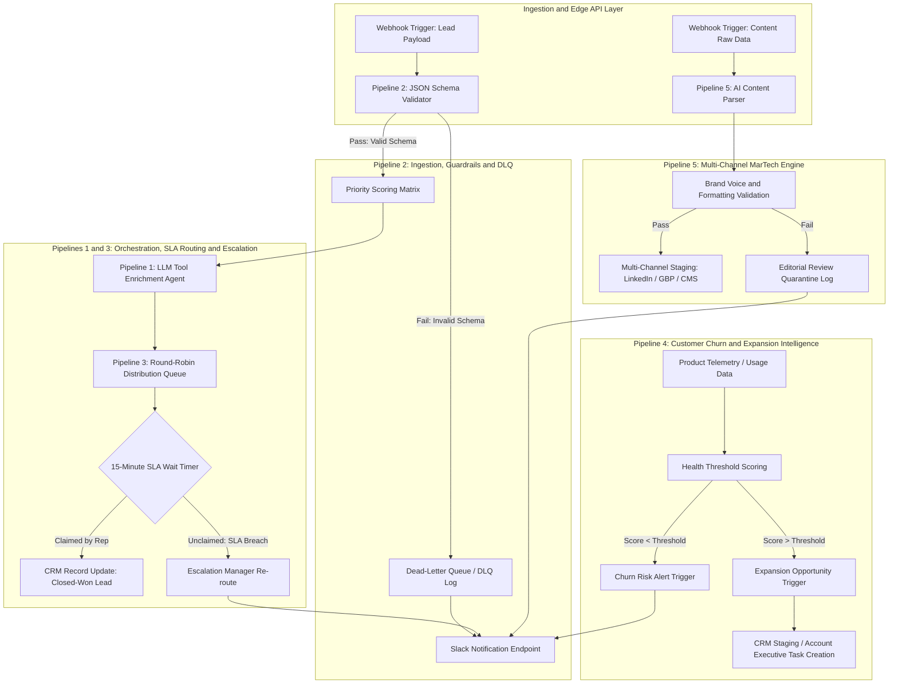

# Enterprise RevOps and MarTech Automation Suite

Production-grade automation architecture built on n8n, REST APIs, JSON Schema Validation, and LLM Agents. Designed to eliminate revenue leakage, enforce speed-to-lead SLAs, automate content distribution, and provide deterministic data quarantine (DLQ) mechanics.

---

## Architectural Suite Breakdown

| Pipeline Repository | Core Problem Solved | Key Tech and Guardrails |
|---|---|---|
| **[Pipeline 1: Agentic Orchestrator](https://github.com/derickturner-hub/pipeline-1-agentic-orchestrator)** | Unstructured lead data and manual enrichment lag | LLM tool calling, external search, dynamic scoring matrix |
| **[Pipeline 2: Lead Ingestion, Guardrails and DLQ](https://github.com/derickturner-hub/pipeline-2-lead-ingestion-dlq)** | Bad data corrupting CRM and silent webhook failures | Deterministic JSON Schema validation, Dead-Letter Queue (DLQ), instant Slack webhooks |
| **[Pipeline 3: SLA Round-Robin Lead Routing](https://github.com/derickturner-hub/pipeline-3-sla-round-robin-routing)** | Unfair rep distribution and slow speed-to-lead | Round-robin distribution queues, 15-minute wait timers, automated escalation routing |
| **[Pipeline 4: Customer Churn and Expansion Intelligence](https://github.com/derickturner-hub/pipeline-4-churn-expansion-intelligence)** | Reactive customer success and missed expansion signals | Product usage telemetry scoring, health threshold triggers, automated CRM staging |
| **[Pipeline 5: Multi-Channel MarTech Content Engine](https://github.com/derickturner-hub/pipeline-5-martech-content-engine)** | High-friction content repurposing and staging delays | AI content parsing, brand voice guardrails, multi-channel staging quarantine |

---

## Business Impact Overlay

Each pipeline is mapped to the economic outcome it drives. Figures below are modeled ranges based on the architecture's design parameters (SLA windows, validation coverage, scoring thresholds), not measured production output, use them as a framework for the real numbers once deployed against a live GTM stack.

| Pipeline | Economic Buyer Metric | Modeled Impact | Mechanism |
|---|---|---|---|
| Pipeline 2: Ingestion, Guardrails & DLQ | Data hygiene cost avoidance | Reduces bad-record CRM contamination by isolating failures before write, instead of downstream cleanup | Schema validation at point of ingestion, not post-hoc audit |
| Pipeline 3: SLA Round-Robin Routing | Speed-to-lead acceleration | Converts a manual, inconsistent assignment process into a bounded 15-minute SLA window with automatic escalation | Round-robin queue plus wait-timer escalation logic |
| Pipeline 4: Churn & Expansion Intelligence | Revenue at risk mitigated / Expansion ARR surfaced | Turns reactive CS motion into a scored, threshold-triggered signal that stages accounts for action before renewal risk or expansion timing is missed | Usage telemetry scoring against health thresholds |
| Pipeline 5: MarTech Content Engine | Content ops throughput | Removes manual repurposing and staging bottlenecks between content creation and multi-channel publish | AI parsing with brand-voice guardrails and quarantine on failure |
| Pipeline 1: Agentic Orchestrator | Enrichment lag elimination | Replaces manual research cycles with real-time tool-calling enrichment at the moment a lead enters the system | LLM tool calling with external search and dynamic scoring |

**How to read this table:** each row is a defensible claim about what the architecture is designed to do, not a claim about deployed results. In an interview, this is the difference between "I built a system that structurally eliminates X failure mode" (true, provable in the code) and "I saved $400K" (unproven without a production deployment). Lead with the former.

---

## Executive Dashboard Layer (Looker Studio / Tableau)

A four-panel executive view fed by Pipeline 4 telemetry scoring, built for a VP of RevOps or CMO audience that needs a 30-second read on revenue health, not a raw data table.

**Panel 1: Speed-to-Lead Velocity**
Rolling average time from lead creation to rep claim against the 15-minute SLA threshold (Pipeline 3). Trend line plus SLA-breach count by week.

**Panel 2: Data Hygiene & DLQ Recovery**
Volume of records quarantined by the schema validator (Pipeline 2), broken out by failure type, with a recovery/reprocessed rate. Shows the system catching problems before they hit the CRM instead of after.

**Panel 3: Revenue at Risk**
Accounts flagged below the health-score threshold (Pipeline 4), segmented by ARR band, with days since last flagged and CS action status. This is the panel a CMO or VP of RevOps looks at first.

**Panel 4: Expansion ARR Opportunity**
Accounts flagged above the health-score threshold (Pipeline 4), segmented by ARR band and expansion signal type, staged against AE task creation status.

**Data source:** Pipeline 4 telemetry scoring output, staged into a CRM object and visualized via Looker Studio or Tableau connector. Panel structure is designed to be BI-tool agnostic, swap either platform in without touching the underlying scoring logic.

The mockup below runs entirely on synthetic data generated to match the schema each pipeline produces in production, not a live Looker Studio or Tableau connection.

[View the live dashboard mockup](dashboard-mockup.html)

---

## Enterprise Architecture Data Flow

